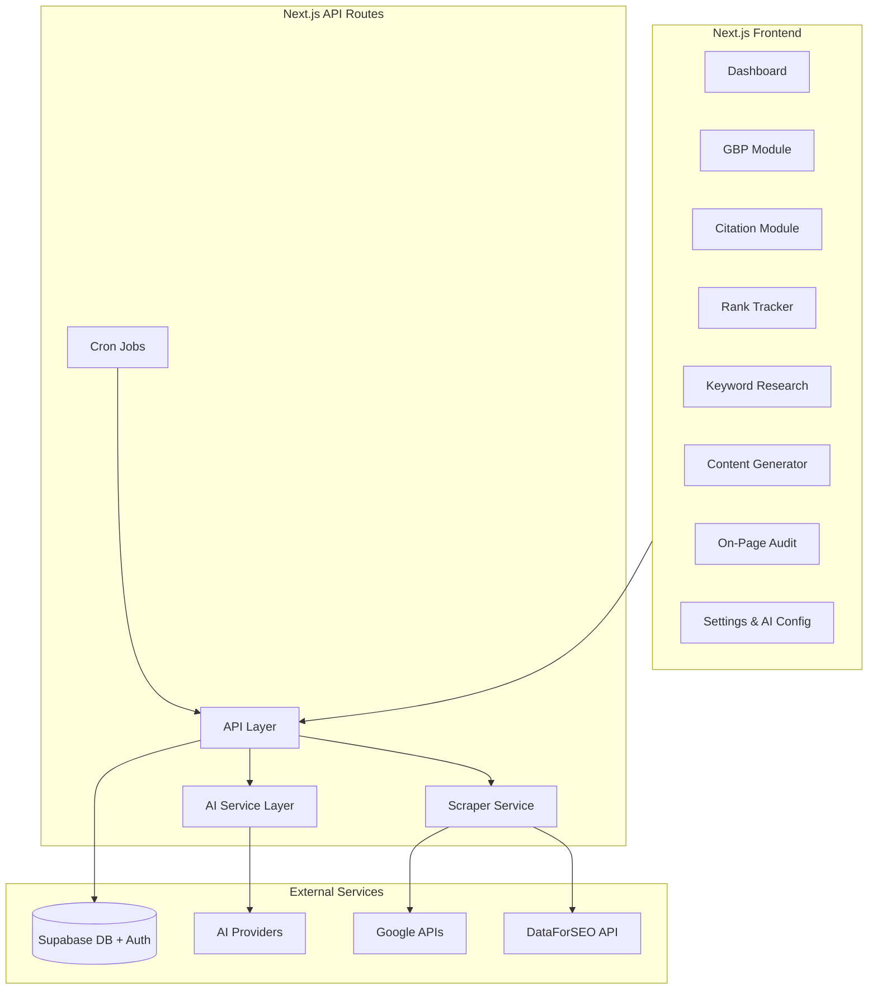
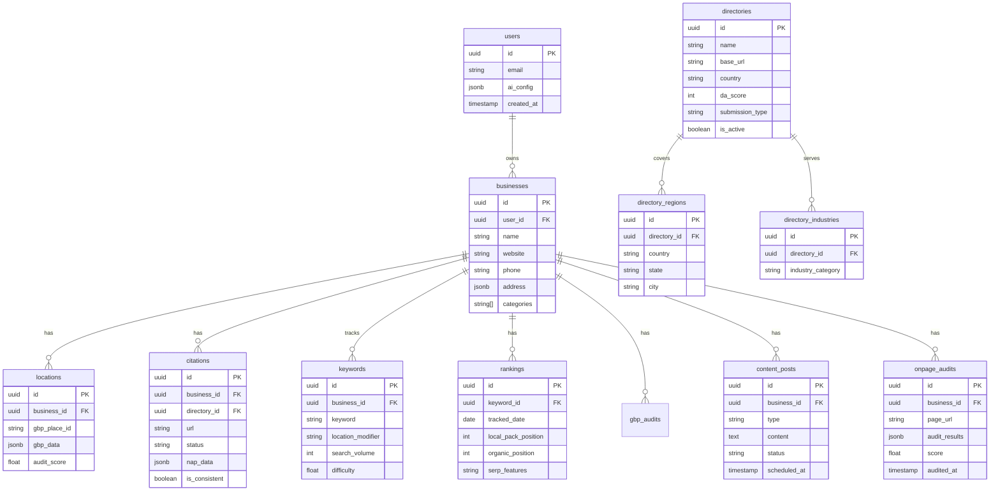

# Local SEO Automation Tool - Implementation Plan

> **Overview:** Build a AI-powered Local SEO automation tool using Next.js and Supabase that helps businesses improve their local search rankings through GBP optimization, citation management, rank tracking, keyword research, on-page SEO audits, and AI content generation.

---

## Architecture Overview



---

## Tech Stack

| Layer | Technology |
|-------|------------|
| Framework | Next.js 14 (App Router) |
| Database | Supabase (PostgreSQL) |
| Auth | Supabase Auth |
| AI | Configurable (OpenAI, Anthropic, Ollama, etc.) |
| Styling | Tailwind CSS + shadcn/ui |
| State | Zustand or React Query |
| Scraping | Puppeteer / Playwright (for rank tracking) |
| SEO APIs | DataForSEO, Google APIs, SerpAPI |
| Deployment | Docker (self-hosted) |

---

## Database Schema (Supabase)



---

## Module Breakdown

### Module 1: Project Setup & Core Infrastructure

- Initialize Next.js 14 project with App Router
- Configure Supabase (database + auth)
- Set up Tailwind CSS + shadcn/ui components
- Create configurable AI service layer (supports OpenAI, Anthropic, Ollama)
- Docker configuration for self-hosting
- Environment variable management

### Module 2: Google Business Profile (GBP) Audit

- GBP data fetching via Google Places API / scraping
- Audit checklist engine (50+ factors):
  - Profile completeness score
  - Category optimization analysis
  - Photo count and quality suggestions
  - Business hours verification
  - Attributes coverage
  - Description keyword analysis
- AI-powered optimization suggestions
- Competitor GBP comparison
- Export audit reports (PDF)

### Module 3: Citation Management (Geo-Targeted)

- **Geo-Targeted Directory Database:**
  - Hierarchical structure: Global > Country > State/Region > City
  - Example for India: JustDial, Sulekha, IndiaMART, TradeIndia (national) + city-specific directories (Mumbai business associations, Ahmedabad trade directories)
  - Example for US: Yelp, YellowPages, BBB, Manta (national) + city chambers, local business associations
  - Admin interface to add/manage directories per region
  - Industry-specific filtering (restaurants, healthcare, legal, etc.)
  - Each directory tagged with: country, regions served, industries, DA score, submission type (free/paid)
  - Database tables: `directories`, `directory_regions`, `directory_industries`
- **Citation Discovery Engine:**
  - Auto-detect business location from address and filter relevant directories only
  - Scrape only location-appropriate directories (no irrelevant US directories for Indian businesses)
  - Find existing citations via brand name + location search
  - Support for non-English directory sites (transliteration handling for Hindi, etc.)
- **NAP Consistency Checker:**
  - Crawl discovered citations for NAP data extraction
  - Flag inconsistencies with canonical NAP
  - Support local address formats (Indian PIN codes, US ZIP codes, UK postcodes, etc.)
  - Phone format validation per country
- **Citation Building Workflow:**
  - Priority scoring based on: DA, local relevance score, industry match
  - Track submission status per directory (pending, submitted, live, rejected)
  - Semi-automated form filling with user verification
  - Reminder system for directories requiring manual submission

### Module 4: Local Rank Tracking

- Keyword rank tracking by location (geo-grid)
- Google Local Pack position tracking
- Organic position tracking
- SERP feature detection (maps, reviews, etc.)
- Historical ranking charts
- Competitor rank tracking
- Automated daily/weekly tracking (cron)
- Ranking alerts (position changes)

### Module 5: Local Keyword Research

- Seed keyword expansion with local modifiers
- Search volume and difficulty data
- Keyword clustering by intent
- Competitor keyword gap analysis
- AI-powered keyword suggestions
- Export keyword lists

### Module 6: On-Page SEO Audit

- Page crawler for local SEO factors:
  - Title tag analysis (location keywords)
  - Meta description audit
  - H1/H2 structure
  - NAP presence on page
  - Schema markup validation (LocalBusiness)
  - Internal linking analysis
  - Mobile-friendliness
  - Page speed insights
- AI-generated fix recommendations
- Schema markup generator (LocalBusiness, FAQ, etc.)
- Bulk audit for multi-location businesses

### Module 7: AI Content Generation & Posting

- GBP post generator (offers, updates, events)
- Location page content generator
- Service area page content
- FAQ content generator
- Blog post ideas for local topics
- Content calendar & scheduling
- Post directly to GBP via API (if available)

### Module 8: Dashboard & Reporting

- Overview dashboard with key metrics
- Per-location performance view
- White-label PDF report generator
- Scheduled email reports
- Action item prioritization
- Integration hooks for Review Management tool

---

## API Integrations Required

| API | Purpose | Cost Model |
|-----|---------|------------|
| Google Places API | GBP data fetching | Pay per request |
| Google PageSpeed API | Page speed audits | Free (limited) |
| DataForSEO | Rank tracking, keywords, SERP | Credit-based |
| SerpAPI (alternative) | SERP data | Subscription |
| OpenAI/Anthropic | AI content generation | Token-based |
| Hunter.io (optional) | Email finding for outreach | Subscription |

---

## Implementation Phases

### Phase 1: Foundation (Week 1-2)

- Project setup, auth, database schema
- AI service layer with provider switching
- Basic dashboard UI
- Business/location management CRUD

### Phase 2: GBP & Citations (Week 3-4)

- GBP audit engine
- Citation discovery and tracking
- NAP consistency checker

### Phase 3: Rank Tracking & Keywords (Week 5-6)

- Rank tracking with geo-targeting
- Keyword research module
- Historical data visualization

### Phase 4: On-Page & Content (Week 7-8)

- On-page audit crawler
- Schema generator
- AI content generation
- Content scheduling

### Phase 5: Polish & Deployment (Week 9-10)

- Reporting system
- Docker packaging
- Documentation
- Testing and bug fixes

---

## Key Files Structure

```
local_seo/
├── src/
│   ├── app/
│   │   ├── (auth)/
│   │   │   ├── login/
│   │   │   └── register/
│   │   ├── (dashboard)/
│   │   │   ├── dashboard/
│   │   │   ├── businesses/
│   │   │   ├── gbp-audit/
│   │   │   ├── citations/
│   │   │   ├── rank-tracker/
│   │   │   ├── keywords/
│   │   │   ├── on-page/
│   │   │   ├── content/
│   │   │   └── settings/
│   │   ├── api/
│   │   │   ├── ai/
│   │   │   ├── gbp/
│   │   │   ├── citations/
│   │   │   ├── rankings/
│   │   │   ├── keywords/
│   │   │   └── audit/
│   │   └── layout.tsx
│   ├── components/
│   │   ├── ui/ (shadcn)
│   │   ├── dashboard/
│   │   ├── gbp/
│   │   ├── citations/
│   │   └── ...
│   ├── lib/
│   │   ├── supabase/
│   │   ├── ai/
│   │   │   ├── providers/
│   │   │   │   ├── openai.ts
│   │   │   │   ├── anthropic.ts
│   │   │   │   └── ollama.ts
│   │   │   └── index.ts
│   │   ├── scrapers/
│   │   ├── seo-apis/
│   │   └── utils/
│   └── types/
├── supabase/
│   └── migrations/
├── docker/
│   ├── Dockerfile
│   └── docker-compose.yml
├── .env.example
└── README.md
```

---

## Estimated Effort

| Module | Complexity | Days |
|--------|------------|------|
| Setup & Infrastructure | Medium | 3-4 |
| GBP Audit | High | 5-6 |
| Citation Management | High | 5-6 |
| Rank Tracking | High | 5-6 |
| Keyword Research | Medium | 3-4 |
| On-Page Audit | High | 5-6 |
| Content Generation | Medium | 4-5 |
| Dashboard & Reports | Medium | 4-5 |
| Docker & Deployment | Low | 2-3 |
| **Total** | | **~40-45 days** |

---

## Implementation Todos

| ID | Task | Status |
|----|------|--------|
| setup-nextjs | Initialize Next.js 14 project with App Router, Tailwind, shadcn/ui | Pending |
| setup-supabase | Configure Supabase - create database schema and auth | Pending |
| ai-service | Build configurable AI service layer (OpenAI, Anthropic, Ollama) | Pending |
| core-ui | Create dashboard layout, navigation, and business management CRUD | Pending |
| gbp-audit | Implement GBP audit engine with scoring and AI recommendations | Pending |
| citations | Build citation discovery, NAP checker, and tracking system | Pending |
| rank-tracking | Implement rank tracking with geo-targeting and historical charts | Pending |
| keyword-research | Build keyword research module with local modifiers | Pending |
| onpage-audit | Create on-page SEO crawler and schema generator | Pending |
| content-gen | Build AI content generation and scheduling system | Pending |
| reporting | Implement dashboard analytics and PDF report generation | Pending |
| docker | Package application with Docker for self-hosting | Pending |

---

## Next Steps

1. Confirm this plan meets your requirements
2. Begin with Phase 1: Project setup, Supabase schema, AI service layer
3. Build each module incrementally with working UI at each step

